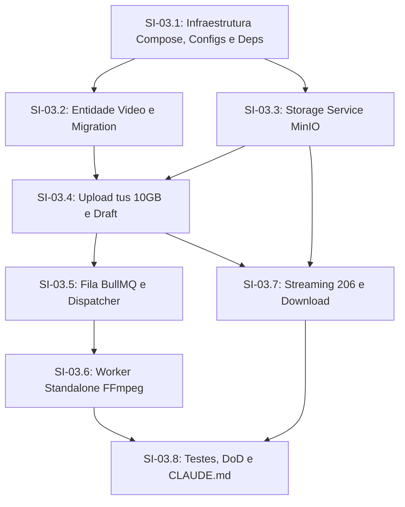

# Phase 03 — Upload e Processamento de Vídeos

## Objective

Entregar a infraestrutura e o módulo backend completo de ingestão e processamento de vídeos: upload retomável de arquivos pesados de até 10GB sem travar a API NestJS, pré-cadastro automático como rascunho, fila assíncrona com Redis + BullMQ, worker dedicado com FFmpeg para extração de metadados e geração de thumbnail, identificador público único nanoid, streaming por HTTP 206 Partial Content e download.

---

## Step Implementations

### SI-03.1 — Dependências, Namespaces de Configuração e Topologia Docker Compose

**Description:** Instalar as dependências de produção da Fase 03 em `nestjs-project/package.json`, criar os namespaces de configuração (`storage` e `queue`) seguindo o padrão `registerAs`, validar variáveis com Joi em `env.validation.ts` e adicionar os serviços `storage` (MinIO), `queue` (Redis) e `worker` no `nestjs-project/compose.yaml`.

**Technical actions:**
- Instalar dependências em `nestjs-project`: `@aws-sdk/client-s3`, `@aws-sdk/s3-request-presigner`, `@tus/server`, `@tus/s3-store`, `@nestjs/bullmq`, `bullmq`, `fluent-ffmpeg`, `@types/fluent-ffmpeg`, `nanoid`.
- Criar `src/config/storage.config.ts`: `registerAs('storage', ...)` com `MINIO_ENDPOINT`, `MINIO_PORT`, `MINIO_ACCESS_KEY`, `MINIO_SECRET_KEY`, `MINIO_USE_SSL`, `STORAGE_BUCKET_VIDEOS`, `STORAGE_BUCKET_THUMBNAILS`.
- Criar `src/config/queue.config.ts`: `registerAs('queue', ...)` com `REDIS_HOST`, `REDIS_PORT`.
- Atualizar `src/config/env.validation.ts` e `.env.example`.
- Atualizar `compose.yaml`:
  - `storage`: imagem `minio/minio:RELEASE.2024-11-07T00-52-28Z`, portas 9000 (API) e 9001 (Console).
  - `queue`: imagem `redis:7-alpine`, porta 6379.
  - `worker`: container Node.js com binários `ffmpeg` e comando `npm run start:worker`.

**Dependencies:** Nenhuma.

**Acceptance criteria:**
- A aplicação inicia sem erros quando as variáveis de storage e queue estão presentes.
- Containers `storage` e `queue` respondem com sucesso no Docker Compose.

---

### SI-03.2 — Entidade Video, Enums de Ciclo de Vida e Migration TypeORM

**Description:** Definir a entidade `Video` ligada ao `Channel` (relação N:1), com campo `file_size` (bigint para suportar 10GB), enums `VideoStatus` e `VideoVisibility`, índices únicos em `public_id` e migration versionada.

**Technical actions:**
- Criar `src/videos/enums/video-status.enum.ts` (`DRAFT`, `UPLOADING`, `PROCESSING`, `READY`, `ERROR`).
- Criar `src/videos/enums/video-visibility.enum.ts` (`PUBLIC`, `UNLISTED`, `PRIVATE`).
- Criar `src/videos/entities/video.entity.ts`:
  - `id`: UUID (PK).
  - `public_id`: nanoid de 12 caracteres (Unique Index).
  - `title`: varchar(150), nullable no draft.
  - `description`: text, nullable.
  - `channel_id`: UUID (FK para `channels`).
  - `status`: enum `VideoStatus`.
  - `visibility`: enum `VideoVisibility`.
  - `file_size`: bigint (para até 10GB).
  - `original_filename`: varchar(255).
  - `video_key`: varchar(255) (chave no bucket do MinIO).
  - `thumbnail_key`: varchar(255), nullable.
  - `duration_in_seconds`: integer, nullable.
  - `metadata`: jsonb (resolução, bitrate, codec).
  - `idempotency_key`: varchar(255), nullable, unique.
  - `created_at` e `updated_at`.
- Gerar migration TypeORM: `npm run migration:generate -- src/database/migrations/CreateVideos`.

**Dependencies:** SI-03.1

**Acceptance criteria:**
- `npm run migration:run` cria a tabela `videos` com foreign keys, constraints e tipos corretos.
- Entidade suporta números de bytes até 10GB sem overflow de inteiros.

---

### SI-03.3 — Camada de Object Storage (MinIO / S3Client)

**Description:** Criar o módulo global `StorageModule` e serviço `StorageService` para encapsular operações com o MinIO local e S3 compatível: inicialização de buckets, streaming com suporte a Range requests e geração de URLs pré-assinadas.

**Technical actions:**
- Criar `src/storage/storage.service.ts`:
  - Inicialização do `S3Client` com `forcePathStyle: true`.
  - Método `onModuleInit` garantindo que os buckets `videos` e `thumbnails` existem.
  - `getSignedDownloadUrl(key, expiresIn)`.
  - `getVideoStream(key, rangeHeader)`: retorna stream parcial e headers HTTP `206`.
  - `uploadBuffer(bucket, key, buffer, mimeType)`.
- Criar `src/storage/storage.module.ts` (@Global).

**Dependencies:** SI-03.1

**Acceptance criteria:**
- Buckets são criados automaticamente no bootstrap.
- Leitura parcial com `Range: bytes=0-1024` retorna exatamente a fatia solicitada.

---

### SI-03.4 — Upload Retomável de 10GB com Protocolo tus e Pré-cadastro (Draft)

**Description:** Implementar o fluxo de ingestão resiliente via protocolo tus: endpoint para pré-cadastro de draft (`POST /videos/upload/init`), delegação de requisições tus (`ALL /videos/upload*`) usando `S3Store` e validações anti-IDOR para garantir que o usuário autenticado é proprietário do canal.

**Technical actions:**
- Criar `src/videos/dto/init-upload.dto.ts` com validação de cap de 10GB (`MAX_VIDEO_FILE_SIZE_BYTES = 10 * 1024 * 1024 * 1024`) e formatos MIME permitidos (`video/mp4`, `video/webm`, `video/quicktime`).
- Criar `src/videos/videos.service.ts`:
  - `initUpload(user, dto)`: valida se o canal pertence ao usuário (Anti-IDOR), verifica idempotência, gera `public_id` via nanoid e persiste o rascunho com status `UPLOADING`.
  - Integração do `Server` tus com `S3Store` apontando para o MinIO.
  - Gancho `onUploadFinish`: marca o vídeo como `PROCESSING` e despacha para a fila BullMQ.
- Criar `src/videos/videos.controller.ts` com rotas protegidas pelo JWT Guard da Fase 02.

**Dependencies:** SI-03.2, SI-03.3

**Acceptance criteria:**
- Requisição com arquivo acima de 10GB é rejeitada com status 413 (`FileTooLargeException`).
- Tentativa de upload em canal de outro usuário é bloqueada com status 403 (`ChannelOwnershipException`).
- O rascunho é persistido no banco no início do upload.

---

### SI-03.5 — Configuração da Fila BullMQ e Publicação de Jobs

**Description:** Configurar o `BullModule` no backend e implementar a publicação do evento assíncrono de processamento de vídeo quando o upload tus é finalizado.

**Technical actions:**
- Registrar `BullModule.forRootAsync` conectado ao host Redis `queue`.
- Registrar a fila `video-processing` no `VideosModule`.
- Publicar job `process-video` contendo `{ videoId, videoKey, channelId }` com 3 tentativas e backoff exponencial.

**Dependencies:** SI-03.4

**Acceptance criteria:**
- Ao finalizar o upload, o job é adicionado na fila Redis sem bloquear a resposta HTTP.

---

### SI-03.6 — Worker Standalone de Vídeo com FFmpeg

**Description:** Criar o processador assíncrono e entrypoint standalone do worker (`src/worker.ts`) consumindo a fila `video-processing`. Executa `ffprobe` para extrair metadados e duração, gera o thumbnail JPG e atualiza o vídeo para `READY` ou `ERROR`.

**Technical actions:**
- Criar `src/videos/processors/video-processing.processor.ts` (@Processor('video-processing')):
  - Baixa chunk/arquivo ou executa pipeline FFmpeg via stream.
  - Extrai metadados: duração em segundos, largura, altura, codec de vídeo/áudio.
  - Renderiza frame de thumbnail em `1280x720` JPG e envia para o bucket `thumbnails` no MinIO.
  - Atualiza a entidade `Video` para `status = READY`, salvando `duration_in_seconds`, `thumbnail_key` e metadados.
  - Em caso de falha após 3 tentativas, transiciona deterministicamente para `status = ERROR`.
- Criar `src/worker.ts` utilizando `NestFactory.createApplicationContext` para executar fora do servidor HTTP.

**Dependencies:** SI-03.5

**Acceptance criteria:**
- Vídeo processado com sucesso tem status alterado para `READY` e thumbnail visível no storage.
- Vídeo corrompido é marcado com status `ERROR` após tentativas sem derrubar a API.

---

### SI-03.7 — Streaming HTTP 206 Partial Content e Download

**Description:** Implementar os endpoints de entrega de vídeo no `VideosController`: streaming com suporte ao cabeçalho `Range` e download direto com `Content-Disposition`.

**Technical actions:**
- Rota `GET /videos/:publicId/stream`:
  - Valida se o vídeo está em status `READY`.
  - Trata o cabeçalho `Range` (ex.: `bytes=0-1048576`).
  - Retorna status `206 Partial Content` com cabeçalhos `Content-Range`, `Accept-Ranges: bytes`, `Content-Length` e o stream do MinIO.
- Rota `GET /videos/:publicId/download`:
  - Retorna link assinado temporário ou stream com `Content-Disposition: attachment; filename="..."`.

**Dependencies:** SI-03.3, SI-03.4

**Acceptance criteria:**
- Player HTML5 consegue reproduzir o vídeo e navegar na timeline (seek) via Range requests 206.
- Download transfere o arquivo original íntegro.

---

### SI-03.8 — Suíte de Testes, Validação DoD e Atualização de Documentação

**Description:** Implementar a suíte completa de testes (unitários e de integração), validar o checklist da Definition of Done (testes verdes, tsc código 0, lint verde) e atualizar o `CLAUDE.md`.

**Technical actions:**
- Testes unitários para `videos.service.spec.ts`, `storage.service.spec.ts` e `video-processing.processor.spec.ts`.
- Testes de integração para persistência e endpoints HTTP.
- Executar `npm test`, `npx tsc --noEmit` e `npm run lint`.
- Atualizar `CLAUDE.md` com os novos módulos, comandos e rotas da Fase 03.

**Dependencies:** SI-03.1 até SI-03.7

**Acceptance criteria:**
- Suíte completa de testes passa com 100% de sucesso.
- `npx tsc --noEmit` finaliza com código 0.
- `CLAUDE.md` reflete fielmente a codebase implementada.

---

## Technical Specifications

### Data Model (`videos` Table)

```sql
CREATE TABLE videos (
    id UUID PRIMARY KEY DEFAULT gen_random_uuid(),
    public_id VARCHAR(12) NOT NULL UNIQUE,
    title VARCHAR(150),
    description TEXT,
    channel_id UUID NOT NULL REFERENCES channels(id) ON DELETE CASCADE,
    status VARCHAR(20) NOT NULL DEFAULT 'DRAFT',
    visibility VARCHAR(20) NOT NULL DEFAULT 'PUBLIC',
    file_size BIGINT NOT NULL,
    original_filename VARCHAR(255) NOT NULL,
    video_key VARCHAR(255) NOT NULL,
    thumbnail_key VARCHAR(255),
    duration_in_seconds INTEGER,
    metadata JSONB,
    idempotency_key VARCHAR(255) UNIQUE,
    created_at TIMESTAMP WITH TIME ZONE DEFAULT NOW(),
    updated_at TIMESTAMP WITH TIME ZONE DEFAULT NOW()
);

CREATE INDEX idx_videos_channel_id ON videos(channel_id);
CREATE INDEX idx_videos_status ON videos(status);
CREATE INDEX idx_videos_public_id ON videos(public_id);
```

### API Contracts

| Método | Rota | Autenticação | Descrição | Status Retorno |
|---|---|---|---|---|
| `POST` | `/videos/upload/init` | JWT Obrigatório | Inicia draft e valida canal (Anti-IDOR) | `201 Created` |
| `PATCH/HEAD/POST` | `/videos/upload/*` | Protocolo tus | Ingestão em chunks de até 10GB | `200 / 204` |
| `GET` | `/videos/:publicId` | Público / Link | Obtém detalhes públicos do vídeo | `200 OK` / `404` |
| `GET` | `/videos/:publicId/stream` | Público / Link | Streaming HTTP 206 com Range headers | `206 Partial Content` |
| `GET` | `/videos/:publicId/download`| Público / Link | Download do arquivo original | `200 OK` / `302 Found` |

### Authorization Matrix

- **Iniciação de Upload (`POST /videos/upload/init`):** Usuário deve estar autenticado e ser o dono legítimo do canal fornecido (`channel.user_id === user.id`). Violações disparam `ChannelOwnershipException` (403).
- **Visualização e Streaming:** Vídeos com visibilidade `PUBLIC` ou `UNLISTED` acessíveis por qualquer visitante anônimo pelo `public_id`. Vídeos `PRIVATE` acessíveis apenas pelo dono do canal.

### Error Catalog

| Código de Exceção | HTTP Status | Causa |
|---|---|---|
| `FILE_TOO_LARGE` | `413 Payload Too Large` | Arquivo informado excede o teto de 10GB. |
| `UNSUPPORTED_VIDEO_FORMAT` | `415 Unsupported Media Type` | Tipo MIME não suportado (permitidos: mp4, webm, quicktime). |
| `CHANNEL_NOT_FOUND` | `404 Not Found` | Canal de destino não existe. |
| `CHANNEL_OWNERSHIP_ERROR`| `403 Forbidden` | Usuário autenticado tentou publicar em canal alheio. |
| `VIDEO_NOT_FOUND` | `404 Not Found` | Vídeo não localizado pelo `public_id`. |
| `VIDEO_NOT_READY` | `409 Conflict` | Tentativa de streaming antes do término do processamento. |

### Events & Messages (BullMQ)

- **Fila:** `video-processing`
- **Job Name:** `process-video`
- **Payload Schema:**
  ```json
  {
    "videoId": "uuid",
    "videoKey": "videos/<publicId>/original.mp4",
    "channelId": "uuid"
  }
  ```
- **Políticas de Resiliência:** 3 tentativas com backoff exponencial (5000ms base).

---

## Dependency Map & Deliverables



**Deliverables da Fase 03:**
1. Ingestão de arquivos de até 10GB funcional com protocolo tus e MinIO.
2. Processamento assíncrono em fila com extração de duração e thumbnail.
3. Streaming por Range HTTP 206 e download do arquivo.
4. URLs curtas únicas geradas por nanoid.
5. Suíte de testes automatizados completa e verde.
