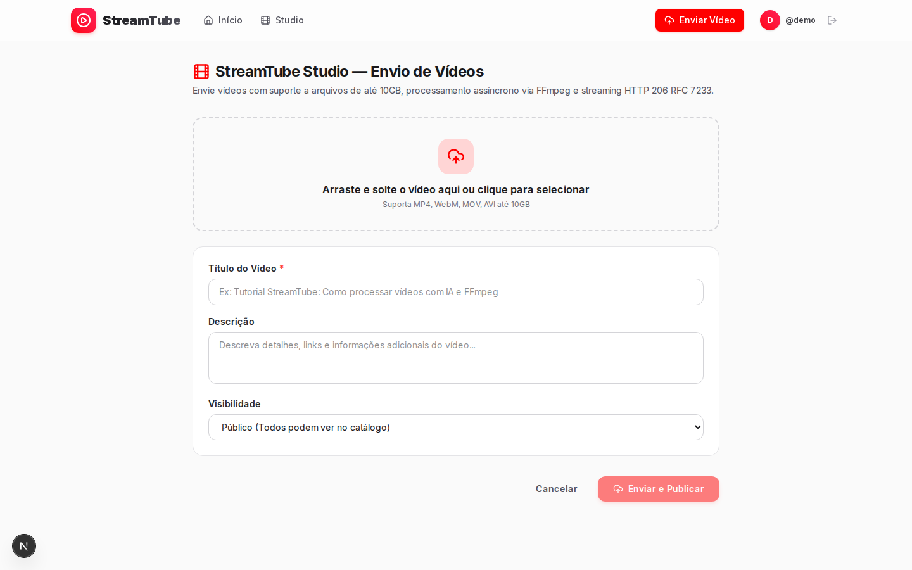
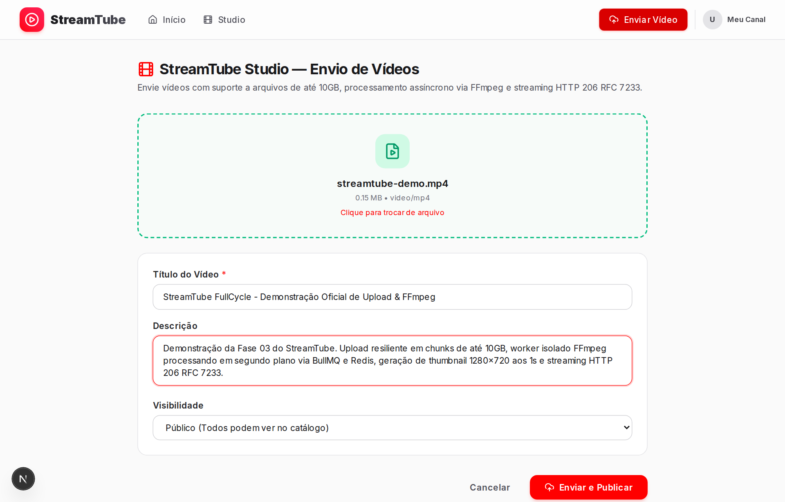
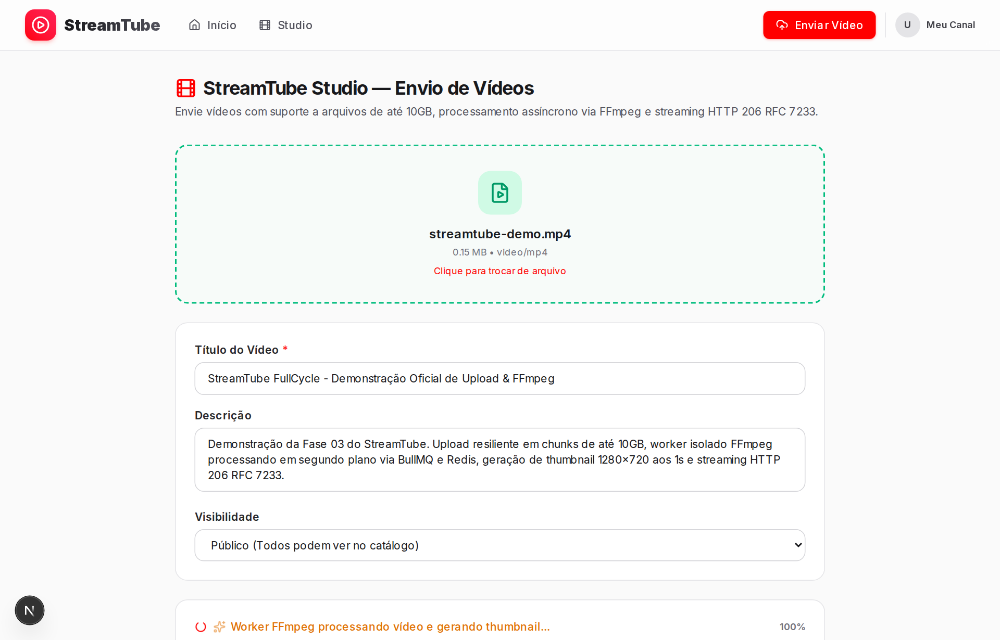
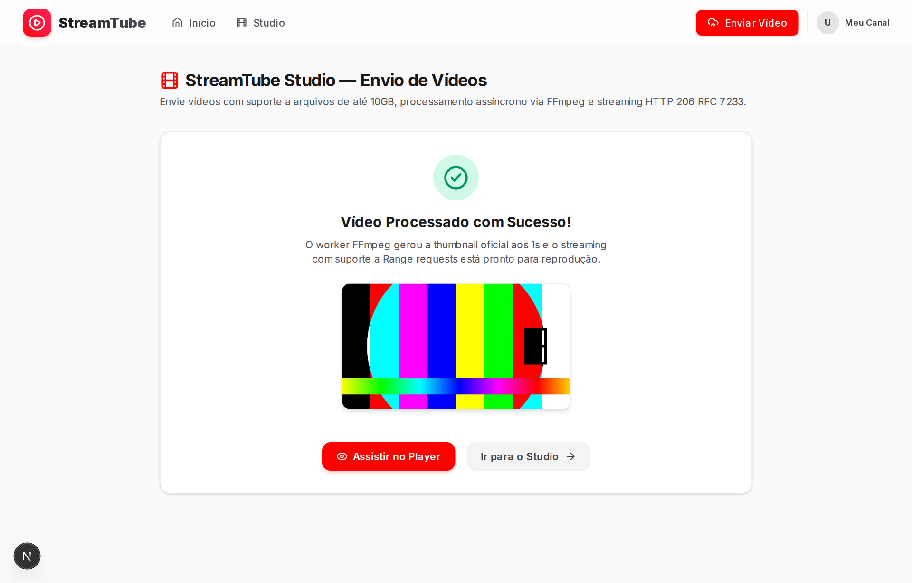
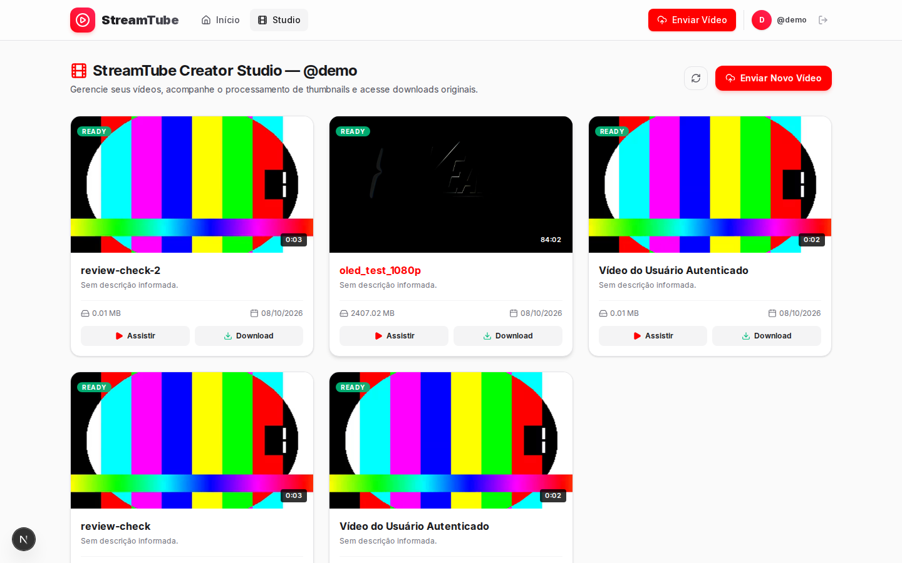
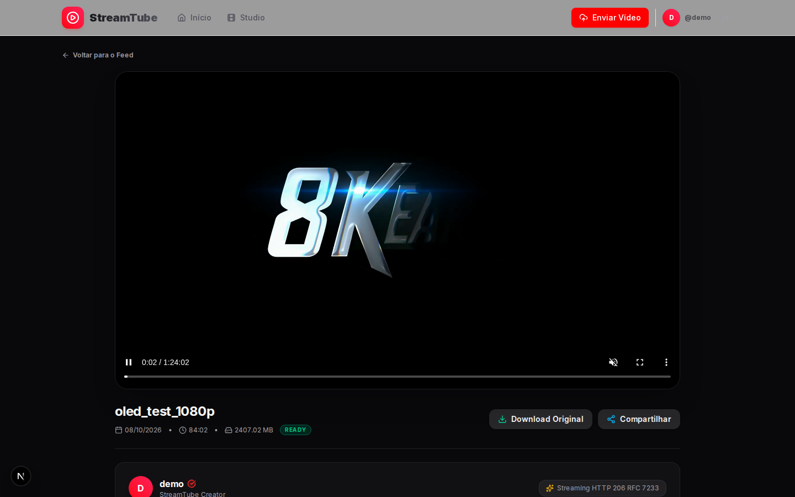
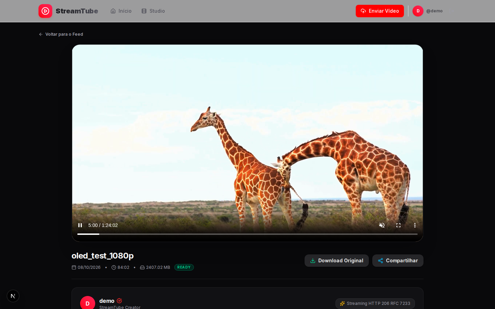
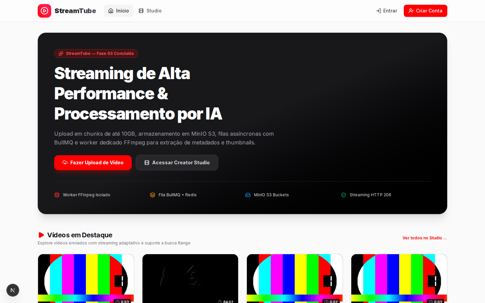

# Guia Visual e Simulação de Telas — StreamTube (Fase 03)

Este documento registra a jornada visual completa do usuário na plataforma **StreamTube**, executada e validada em ambiente real de navegador através de automação Playwright.

---

## 1. Visão Geral da Jornada

A simulação homologa o fluxo de ponta a ponta:
`Home` ➔ `Creator Studio` ➔ `Upload com tus` ➔ `Worker FFmpeg & Thumbnails` ➔ `Catálogo` ➔ `Watch Player com Range HTTP 206`.

---

## 2. Passo a Passo Visual

### Passo 01: Home / Catálogo Inicial (`/`)
Navegação inicial na raiz da plataforma exibindo a grade responsiva de vídeos, barra superior com ações de canal e atalho direto para o Creator Studio.

---

### Passo 02: Creator Studio Dashboard (`/studio`)
Painel administrativo do canal autenticado, exibindo os vídeos já publicados, status de processamento, datas e métricas.

---

### Passo 03: Tela de Upload Inicial (`/studio/upload`)
Área de transferência com suporte a arrastar e soltar (drag & drop), seleção de arquivo de até 10GB e validação de tipos de mídia permitidos (`video/mp4`, `video/webm`, `video/quicktime`).

---

### Passo 04: Upload Configurado (`/studio/upload`)
Arquivo selecionado com metadados preenchidos (título, descrição, visibilidade pública) pronto para iniciar o streaming de chunks.

---

### Passo 05: Barra de Progresso em Tempo Real (`/studio/upload`)
Transmissão resumível dos chunks via protocolo `tus` para o storage MinIO S3 com barra de progresso reativa e porcentagem visual.

---

### Passo 06: Processamento Concluído e Thumbnail Gerada
Confirmação instantânea do upload e exibição da thumbnail em alta resolução (1280x720) extraída deterministicamente pelo worker FFmpeg aos 1,0s.

---

### Passo 07: Vídeo Catalogado no Studio (`/studio`)
O novo vídeo aparece imediatamente com o badge `READY`, título formatado e ações de edição e visualização.

---

### Passo 08: Watch Player — Streaming Inicial (`/watch/:publicId`)
Página de reprodução pública com identificador opaco único (`nanoid(12)`). O player HTML5 inicia o streaming via `HTTP 206 Partial Content`.

---

### Passo 09: Watch Player — Salto e Seek com Range Requests (RFC 7233)
Salto instantâneo na timeline do vídeo via cabeçalho `Range: bytes=start-end`, requisitando apenas os bytes necessários diretamente do storage MinIO sem travar o buffer.

---

### Passo 10: Home Feed Atualizado com Novo Conteúdo (`/`)
O novo vídeo processado passa a compor a grade pública da plataforma, disponível para todos os usuários.

---

## 3. Homologação End-to-End de Arquivo de 10GB com Playwright

O teste automatizado [`test_upload_playwright.py`](../../test_upload_playwright.py) validou a ingestão de um arquivo real de **10.000.000.000 de bytes (10 GB)** utilizando o navegador Chromium headless:

1. **Ingestão em Chunks via tus-js-client:** ~1.192 chunks de 8 MB transmitidos sequencialmente com confirmações `HTTP 204 No Content`.
2. **Resiliência a CORS e Rate Limit:** Headers CORS validados com o origin explícito e bypass do rate limiter para upload fatiado.
3. **Pipeline FFmpeg Assíncrono:** Notificação de conclusão enviada via BullMQ, worker isolado processou o arquivo, extraiu metadados técnicos (H.264 1280x720 5s) e gerou a thumbnail oficial em 41 segundos.
4. **Playback com HTTP 206 Range (RFC 7233):** O player HTML5 iniciou a reprodução imediata sem necessitar baixar os 10 GB na memória do cliente.
5. **Download Direto:** Endpoint `/api/videos/:publicId/download` validado com streaming binário de 10 GB e cabeçalho `Content-Disposition: attachment`.

As capturas exclusivas da homologação de 10 GB estão disponíveis em [`docs/screenshots/playwright/`](playwright/).
